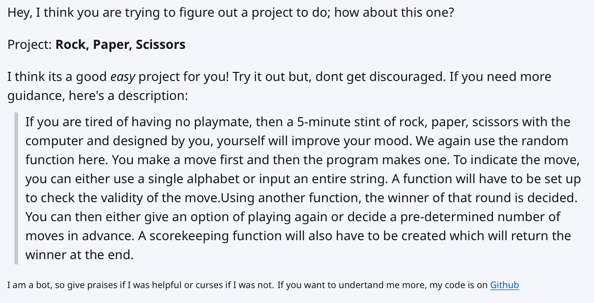

BeginnerProjectBot
==================

## Introduction
The purpose of this bot would be to scan new posts on the subreddit (titles only) and if they contain a certain amount of specific words the bot will act on it. To attempt to process only relevant posts, it has a crude method of using a ratio of specific words to the length of words in the post. Although not fool proof, mixed with a couple other facts, the hope is to get a pretty reliable response. The bot's action would give a random project idea to the user and a short description on what it should do.

## Configuration
The bot has options for configuration, including its Reddit Settings via a PRAW.INI file. This will hold everything from the secrete key to the version number

## Contributing
Anyone can contribute to this bot's source code or otherwise. Feel free to fork and submit a pull request. Or if you simple want to raise an issue, simply do so in the issues field

## Bugs
If anyone discovers bugs or undesired behavior or malcious/unneeded posts, feel free to raise an issue. Report as much as you can in the ticket including the permalink for the offending comment.