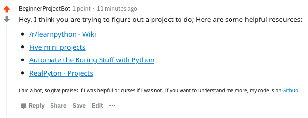

BeginnerProjectBot
==================


## Introduction
The purpose of this bot would be to scan new posts on given subreddits (titles only) and if they contain a certain amount of specific words the bot will act on it. To attempt to process only relevant posts, it has a crude method of using a ratio of specific words to the length of words in the post. Although not fool proof, mixed with a couple other facts, the hope is to get a pretty reliable response.

The bot's action is to give a static message of resources where a person can go for project suggestions



An alternate action is to have the user 'call' the bot by using the phrase **!projectbot** to get a random project.


## Reddit Usage

The **BeginnerProjectBot** has two primary function; Indirect and direct methods. 

### Indirect Method

The indirect way happens when someone posts on a subreddit when asking for help (decided by an algorithm for the bot). This will reply to their post a static message with common resources.

### Direct Method

The direct way happens when someone directly calls the bot directly by calling bot by name or using the key phrase: *!projectbot* in a comment. This will reply to the user a random project.

A difficulty word (easy, medium, hard) can be added to the call to determine the level of the random project. If no word is added, a random project of a random difficulty is assigned.

## Bot Runtime Usage
```
Usage: python3 bot.py [action] <args...>
    action: All possible actions which can be added to bot
        run: Run the default application of the bot
        test: Test a specific phrase to determine how the bot interprets it. It does not run the main application
            phrase: Add this following the test action
        sim: Set the bot to simulation mode where it does not post to reddit
            confirm: Add this following the test action
        help: Show help/usage output
```

## Configuration
The bot has options for configuration, including its Reddit Settings via a PRAW.INI file. This will hold everything from the secret key to the version number

An example INI file is in the repo as `praw.ini.example`. The script `scripts/create-init.py` uses the environment variables to fill in the config file

Name | Environment Variable | Required For Which Aspect | Description
-----|----------------------|---------------------------|------------
client_id | REDDIT_CLIENT_ID | Reddit Praw | The client ID to access a reddit application
client_secret | REDDIT_CLIENT_SECRET | Reddit Praw | The client secret to access a reddit application
user_agent | Dynamically created in bot | Reddit Praw | The HTTP user agent required for PRAW, made of the username, version, and author fields
username | REDDIT_USERNAME | Reddit | The username of the account
password | REDDIT_PASSWORD | Reddit | The password of the account
mongo_username | MONGO_USERNAME | MongoDB | The mongodb username
mango_password | MONGO_PASSWORD | MongoDB | The mongodb password
mongo_database | MONGO_DATABASE | MongoDB | The mongodb database name
version | Hardcoded from example INI | Bot | The version of the bot
author | Hardcoded from example INI | Bot | The creator/implementation of the bot
repo_url | Hardcoded from example INI | Bot | The GitHub repo URL


## Contributing
Anyone can contribute to this bot's source code or otherwise. Feel free to fork and submit a pull request. Or if you simple want to raise an issue, simply do so in the issues field

## Bugs
If anyone discovers bugs or undesired behavior or malcious/unneeded posts, feel free to raise an issue. Report as much as you can in the ticket including the permalink for the offending comment.